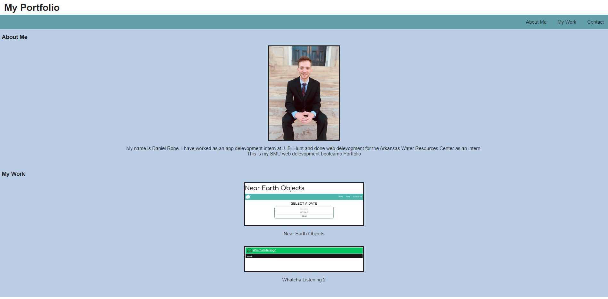

# Week_2_Portfolio

## Description

Created a basic starter portfolio to display the projects we have currently completed. The page was created using HTML and styled with CSS.

## Links

Link to repository - https://github.com/Daniel-robe/Week_2_Portfolio
Link to deployed site - https://daniel-robe.github.io/Week_2_Portfolio/

## Screenshots 

